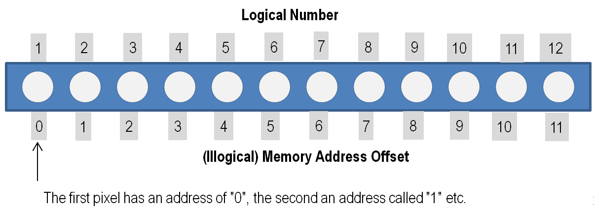

# Moving Rainbow Programmer's Guide
======
This guide assumes you are somewhat familiar with hooking up your LED strip to your Arduino and are ready to learn how to programthe LED strip.  This programming guide will cover:
- How to use the setup and loop functions
- How to set the color of a pixel
- How to use a for loop to change all the colors in the strip
- How to use the delay function slow down your patterns
- How to create and use functions
- How to use various such as the if/then/else to conditionally turn on pixels

## Getting Started
### Setup and Loop
In these labs our Arduino programs will have four parts.
1. A, preamble section that will declare various things
2. A setup function, setup()
3. A looping function called loop() that will run until the devices is reset or turned off and loop.
4. A list of functions that are called by the setup and loop functions

### Sample Preamble
```
#include <Adafruit_NeoPixel.h>
#define LEDPIN 12 // connect the Data from the strip to this pin on the Arduino
#define NUMBER_PIEXELS 12 // the number of pixels in your LED strip
Adafruit_NeoPixel strip = Adafruit_NeoPixel(NUMBER_PIEXELS, LEDPIN, NEO_GRB + NEO_KHZ800);
```
#### Setup
This function will run only once.  It is used to setup the initial memory variables we need in our programs
```
void setup() {
  strip.begin(); // Initialize all the variables
  strip.show(); // Initialize all pixels in the strip to be off
}
```
#### Loop
The loop program will run over and over.  Here is a sample program that will blink the first pixel in the strip:
```
void loop() {
  strip.setPixelColor(0, 255, 0, 0); // set pixel 0 to be red
  strip.show(); // send red to strip
  delay(1000); // wait a second
  strip.setPixelColor(0, 0, 0, 0); // set pixel 0 to be red
  strip.show(); // send off to strip
  delay(1000); // wait a second
};
```

### Basic Functions

#### Initialize strip
```
Adafruit_NeoPixel strip = Adafruit_NeoPixel(NUMBER_PIEXELS, LEDPIN, NEO_GRB + NEO_KHZ800);
```
#### Send data to the strip
```
strip.show();
```
#### Set a pixel color
The most important function in our programs is the function to set one of the pixels to a specific color.  We use the following function:
```
strip.setPixelColor(index, red, green, blue);
```
Where the "index" is the number of pixel to set, starting at pixel 0.  The second pixel is called "1" etc.  Each of the index numbers is off by one.


The first pixel has an address of "0", the second an address called "1" etc.
#### Wait
```
delay(milliseconds)
```


